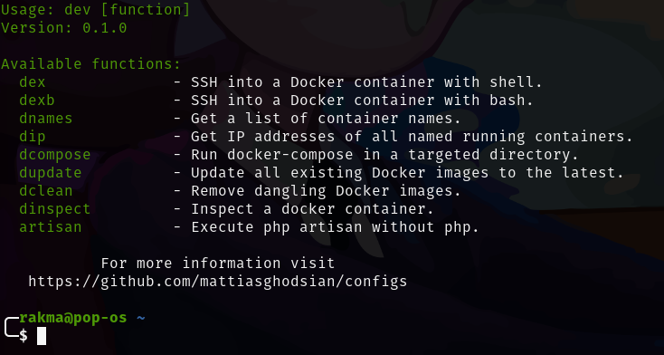

# Configs
This repository contains files and scripts to streamline my workflow and configure my system. The Makefile provides easy installation of my dev command, including frequently used commands and shortcuts. It also simplifies the installation of useful packages and configures files. It's especially useful for quickly setting up a fresh debian distros, allowing efficient customization and boosting productivity.

# Install
Open a terminal and navigate to the directory where the Makefile is located, run following command to install the scripts.
```
make install
```
or 
```
make uninstall
```

then run dev
```
dev
```




## TODO
- Move all installers to sub directory `installers`.
- Create general app.sh isntall curl,git etc then run all files in subdirectory of `installers`.
- Add vscode, flameshot, postman, brave, dbeaver, docker, zsh, oh my zsh installers.
- Add script to install global npm packages like vue cli.